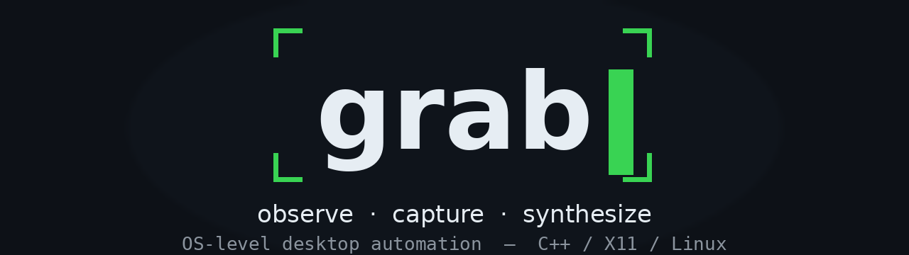

<p align="center">
  
</p>


Grab is a library and CLI tool for interacting with a PC

Its very useful if you want to :

* Automate clicks for App navigation
* Control your mouse via coordinates and paths 
* Harness AI to grab screenshots of your project
* Visual Testing Automation


## Support

### Operating systems

| OS               | Status        | Backend                        |
| ---------------- | ------------- | ------------------------------ |
| Linux · X11      | ✅ Supported  | XCB / XInput2 / XTest          |
| Linux · Wayland  | 🚧 Planned    | —                              |
| Windows          | 🚧 Planned    | —                              |
| macOS            | 🚧 Planned    | —                              |

### Technologies

| Capability          | Technology                          |
| ------------------- | ----------------------------------- |
| Screen capture      | XComposite + XShm                   |
| Screenshots (PNG)   | in-tree encoder + zlib              |
| Video recording     | libavcodec (FFmpeg)                 |
| Input synthesis     | XTest + xkbcommon                   |
| Input observation   | XInput2, evdev                      |
| Windows & focus     | XCB / EWMH                          |
| Accessibility       | AT-SPI over D-Bus                   |
| Event daemon        | gRPC + Protobuf                     |
| Notifications       | D-Bus                               |


## Build

```sh
cmake --preset default
cmake --build build -j"$(nproc)"
ctest --test-dir build
```

Requires X11. Toolchain: C++23, Clang, CMake + Ninja. Process ownership via
`grab::OwnedProcess` requires Linux 5.4 or newer and glibc 2.36 or newer.
